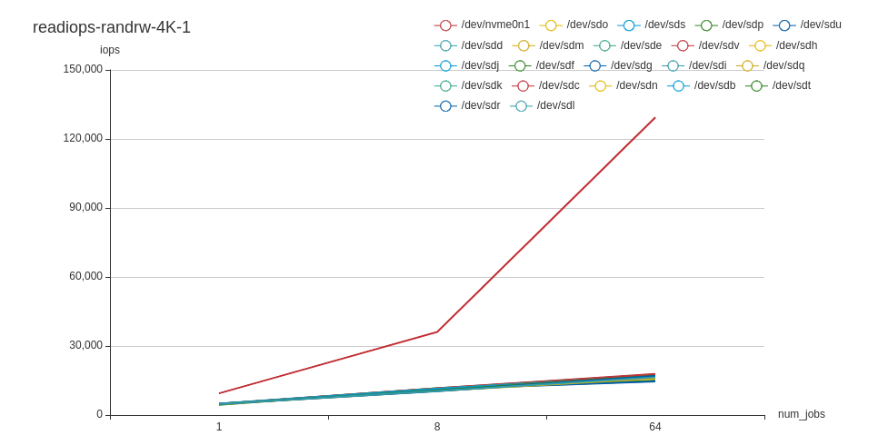
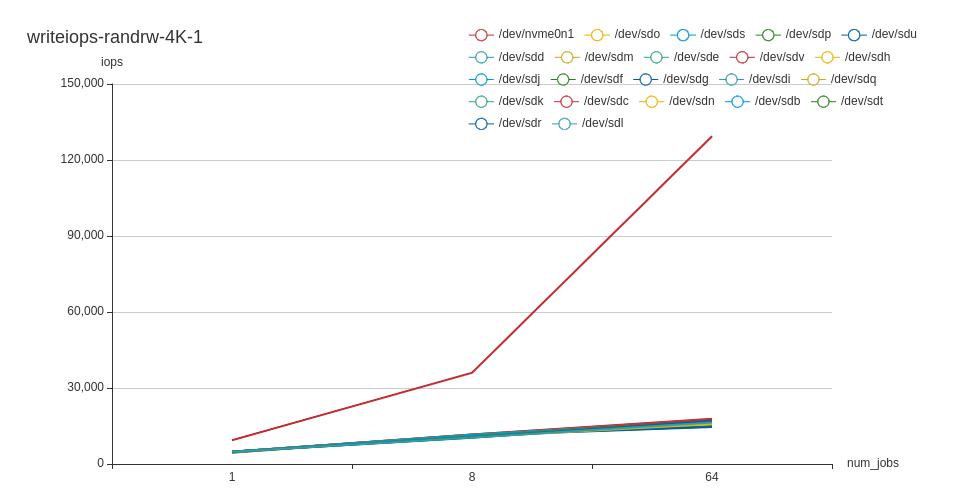
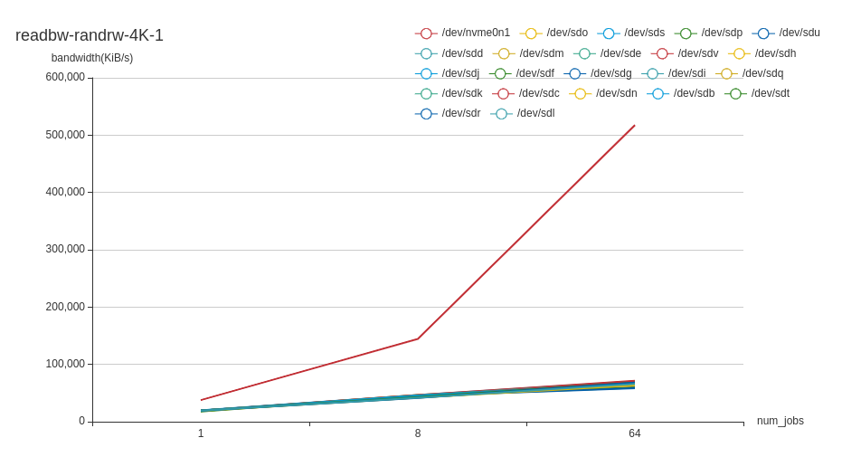
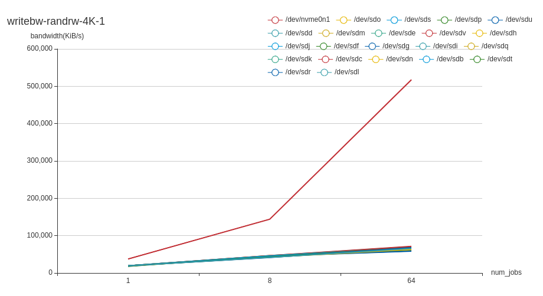
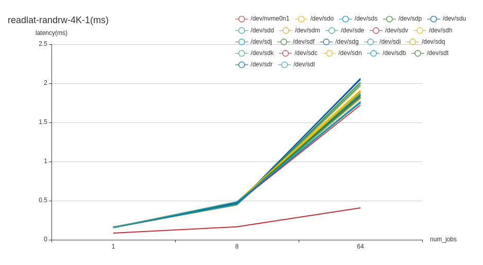
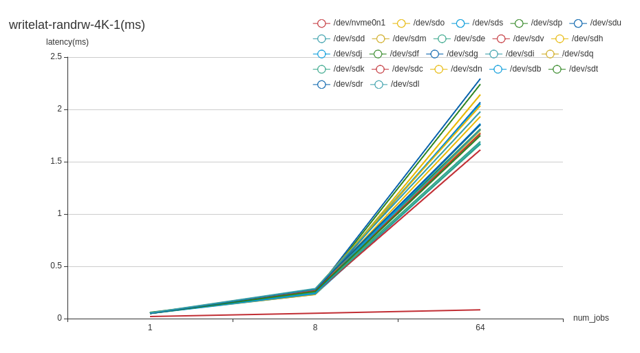

# fio-benchmark

fio-benchmark is a wrapper for [fio](https://github.com/axboe/fio) benchmarks. Fio (Flexible I/O Tester) is a tool for storage performance benchmarking.

## Building and running

### Test and Build

```
make test
make build 
```

### Running

Running the fio-benchmark requires `fio` and the `libaio` development packages to be installed on the host.

```
bin/fio-benchmark <flags>
```

#### Usage

```
bin/fio-benchmark -h
```

#### Flags
| Name            |  Description |
|-----------------|--------------------------------------------------------------------------------------------------|
| --output-file   | redirect fio benchmark result to output file                                                     |
| --render-format | redirect fio benchmark result to output file with rendered format, eg. table, html, markdown, csv|
| --config-file   | fio benchmark config file                                                                        |
| --chart-file    | echarts file for fio benchmark result                                                            |
| --dryrun        | dry-run (default true)                                                                           |
| --v             | number for the log level verbosity                                                               |

### Config file
```yaml
fio_settings:
  numjobs: # 1 2 4 8 16 32 64 128 256 512 1024 2048
  - 1
  - 2
  - 4
  - 8
  - 16
  - 32
  - 64
  - 128
  - 512
  ioengine: libaio
  direct: true
  verify: true
  bs: # block size 4K, 8K, 16K, 32K, 256K, 512K, 1M, 4M
  - 4K
  - 16K
  - 32K 
  - 256K 
  - 1M
  - 4M
  runtime: 15 # seconds
  iodepth:  # 1, 2, 4, 8, 16, 32, 64, 128
  - 1
  - 4
  - 8
  - 16
  - 32
  rw: # read, write, randread, randwrite, rw, randrw
  - read
  - write
  - randread
  - randwrite
  - rw
  - randrw
  filename: # device name or file name, which can be ignore if specify `use_all_disks`
  # - /dev/sdb
  # - /dev/sdc
use_all_disks: true # except root disk
workers: 8 # It is recommended to be less than or equal to the number of disks
```

## Output
The output format supports table, csv, markdown and html, as shown below is the markdown output.
| filename | rw | numjobs | runtime | direct | blocksize | iodepth | read-iops-mean | read-bw-mean(KiB/s) | latency-read-min(us) | latency-read-max(us) | latency-read-mean(us) | read-stddev(us) | write-iops-mean | write-bw-mean(KiB/s) | latency-write-min(us) | latency-write-max(us) | latency-write-mean(us) | latency-write-stddev(us) | ioengine | verify |
| --- | --- | --- | --- | --- | --- | --- | ---:| ---:| ---:| ---:| ---:| ---:| ---:| ---:| ---:| ---:| ---:| ---:| --- | --- |
| /dev/vdb | randread | 1 | 10s | 1 | 4K | 1 | 1293.736842 | 5175 | 331 | 11699 | 767.447327868 | 570.548890303 | 0 | 0 | 0 | 0 | 0 | 0 | libaio |  |
| /dev/vdb | randread | 1 | 10s | 1 | 4M | 1 | 194 | 794624 | 2902 | 22411 | 5088.167162755 | 1714.9174059260001 | 0 | 0 | 0 | 0 | 0 | 0 | libaio |  |
| /dev/vdb | randrw | 1 | 10s | 1 | 4K | 1 | 362.421053 | 1449.684211 | 385 | 21776 | 844.861519167 | 759.336552743 | 374 | 1496 | 894 | 13723 | 1857.085421081 | 907.922152548 | libaio |  |
| /dev/vdb | randrw | 1 | 10s | 1 | 4M | 1 | 65.736842 | 269408.368421 | 3120 | 13016 | 5024.218700608 | 1312.067850423 | 70.052632 | 287099.578947 | 5350 | 20451 | 9557.766565093 | 2282.874786967 | libaio |  |
| /dev/vdb | randread | 1 | 10s | 1 | 4K | 8 | 7964.263158 | 31857.210526 | 247 | 23732 | 1014.712046869 | 1101.238732099 | 0 | 0 | 0 | 0 | 0 | 0 | libaio |  |
| /dev/vdb | randread | 1 | 10s | 1 | 4M | 8 | 571.1 | 2.3392256e+06 | 6858 | 30528 | 13988.059211787 | 2452.765283563 | 0 | 0 | 0 | 0 | 0 | 0 | libaio |  |
| /dev/vdb | randrw | 1 | 10s | 1 | 4K | 8 | 1687.894737 | 6751.631579 | 325 | 20741 | 1597.5282114870001 | 1364.977644475 | 1682.210526 | 6728.894737 | 715 | 33321 | 3123.3354368349997 | 1706.9086694060002 | libaio |  |
| /dev/vdb | randrw | 1 | 10s | 1 | 4M | 8 | 172.210526 | 705374.315789 | 4165 | 48975 | 20696.684009849 | 6614.97049128 | 178.315789 | 730381.473684 | 6559 | 58901 | 24773.204924497 | 7435.457873275 | libaio |  |
| /dev/vdb | randread | 64 | 10s | 1 | 4K | 1 | 47071.947368 | 188294.789474 | 292 | 19299 | 1350.164312503 | 1246.4954571140001 | 0 | 0 | 0 | 0 | 0 | 0 | libaio |  |
| /dev/vdb | randread | 64 | 10s | 1 | 4M | 1 | 557.576316 | 2.303889594737e+06 | 17711 | 483508 | 113042.125402426 | 40485.47291615001 | 0 | 0 | 0 | 0 | 0 | 0 | libaio |  |
| /dev/vdb | randrw | 64 | 10s | 1 | 4K | 1 | 3666.442105 | 14678.226316 | 325 | 34967 | 7718.326063269 | 5344.966163796 | 3684.721053 | 14751.184211 | 718 | 39209 | 9707.844039832 | 5285.680874424001 | libaio |  |
| /dev/vdb | randrw | 64 | 10s | 1 | 4M | 1 | 235.727429 | 1.02073002694e+06 | 27260 | 352195 | 110020.34759990101 | 40661.391080688 | 191.289405 | 840594.888528 | 42418 | 794275 | 218030.990302003 | 88695.131158644 | libaio |  |
| /dev/vdb | randread | 64 | 10s | 1 | 4K | 8 | 62599.052632 | 250409.789474 | 359 | 90016 | 8211.310948256 | 5643.636676233 | 0 | 0 | 0 | 0 | 0 | 0 | libaio |  |
| /dev/vdb | randread | 64 | 10s | 1 | 4M | 8 | 570.992105 | 2.362545355556e+06 | 26523 | 1687880 | 843044.964216157 | 203097.462191764 | 0 | 0 | 0 | 0 | 0 | 0 | libaio |  |
| /dev/vdb | randrw | 64 | 10s | 1 | 4K | 8 | 8724.318421 | 34931.281579 | 945 | 200367 | 21820.757286874 | 17474.897795525 | 8680.092105 | 34754.981579 | 2222 | 243575 | 36839.26430776 | 20808.991761455 | libaio |  |
| /dev/vdb | randrw | 64 | 10s | 1 | 4M | 8 | 237.139123 | 1.020445982223e+06 | 73830 | 2361431 | 1.098625413142923e+06 | 363418.863296889 | 227.950944 | 986561.655402 | 83438 | 2508119 | 1.2158841033915319e+06 | 357980.681793531 | libaio |  |
| /dev/vdb | randread | 8 | 10s | 1 | 4K | 1 | 10086.947368 | 40348.631579 | 241 | 17189 | 776.116822241 | 771.139488346 | 0 | 0 | 0 | 0 | 0 | 0 | libaio |  |
| /dev/vdb | randread | 8 | 10s | 1 | 4M | 1 | 560.578947 | 2.296163315789e+06 | 6785 | 41896 | 14234.961047695 | 2574.959017616 | 0 | 0 | 0 | 0 | 0 | 0 | libaio |  |
| /dev/vdb | randrw | 8 | 10s | 1 | 4K | 1 | 1932.842105 | 7731.473684 | 308 | 22675 | 1347.124572441 | 1133.77240129 | 1961.473684 | 7845.947368 | 657 | 20761 | 2714.340139951 | 1296.6844481540002 | libaio |  |
| /dev/vdb | randrw | 8 | 10s | 1 | 4M | 1 | 174.802632 | 717625.181579 | 3925 | 115037 | 20389.840420033997 | 6810.612514501 | 180.702632 | 741806.518421 | 8122 | 126135 | 24353.666321212 | 7973.84264465 | libaio |  |
| /dev/vdb | randread | 8 | 10s | 1 | 4K | 8 | 53430.25 | 213721 | 266 | 31175 | 1194.890215171 | 1163.429326156 | 0 | 0 | 0 | 0 | 0 | 0 | libaio |  |
| /dev/vdb | randread | 8 | 10s | 1 | 4M | 8 | 545.9 | 2.2406038e+06 | 22207 | 554612 | 116589.030573856 | 43146.172870467 | 0 | 0 | 0 | 0 | 0 | 0 | libaio |  |
| /dev/vdb | randrw | 8 | 10s | 1 | 4K | 8 | 3651.105263 | 14604.421053 | 312 | 36674 | 7695.009920367 | 5345.517337829 | 3700.368421 | 14801.473684 | 688 | 43692 | 9686.040599157 | 5285.046210396 | libaio |  |
| /dev/vdb | randrw | 8 | 10s | 1 | 4M | 8 | 184.05 | 758266.8 | 30318 | 413193 | 107105.41641122999 | 37697.093566174 | 188.55 | 776762.45 | 21229 | 1009750 | 230698.849119979 | 101526.879999234 | libaio |  |

At the same time, read and write IOPS, bandwidth, and latency echarts will also be generated, thanks for the [go-echarts](https://github.com/go-echarts/go-echarts).
<p align="center">
    
</p>
<p align="center">
    
</p>
<p align="center">
    
</p>
<p align="center">
    
</p>
<p align="center">
    
</p>
<p align="center">
    
</p>
